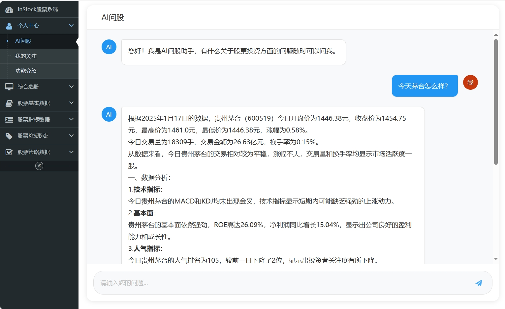
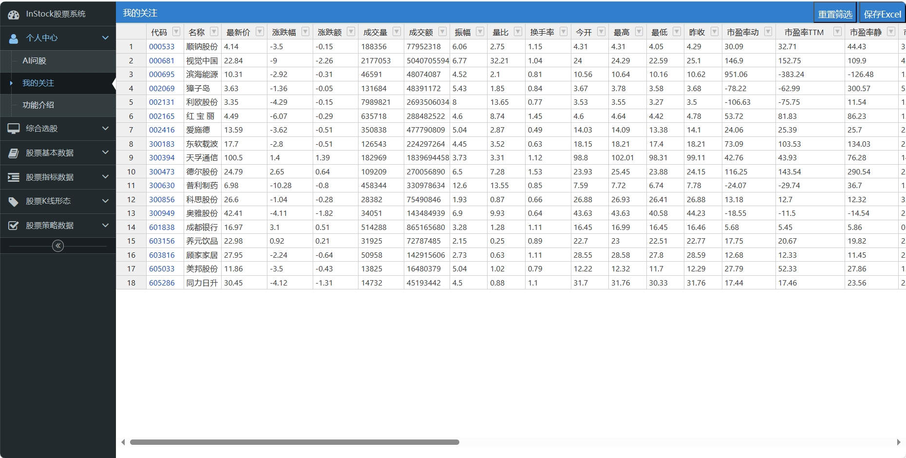

**InStock-AI AI问股**
## 说明：
AI问股，是基于InStock爬取数据，用AI作专业分析。

基本逻辑是通过LLM识别用户提问的问题，提取股票名称或代码，通过API查询出该支股票的最后交易日数据，返回的JSON格式数据，由LLM对数据进行分析，并组织成自然语言输出。

保留了InStock的web选股界面。

把我关注的股票独立出来了。

spreadjs换成了开源的handsontable。

## LLM接入：
1.先安装openai库，只要是支持openai标准的api就行，不一定要chatgpt系列的大模型。

2.在chat_handler.py中，修改第10、11行，填入你的api key和url。在第74、109、143行，修改为你的模型名称。

视频演示看这里：https://youtu.be/ZHoPKw7EjtM
在线演示：http://v.bolangcaijing.com   数据是旧的，没有每天去爬

